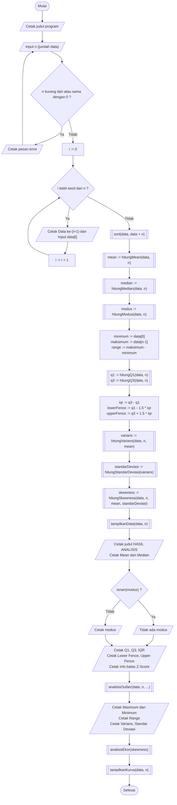
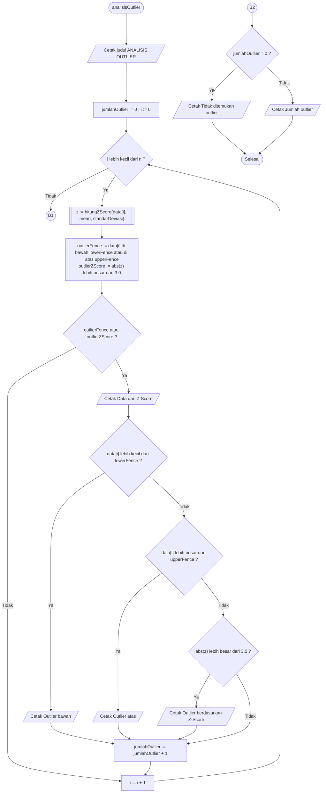
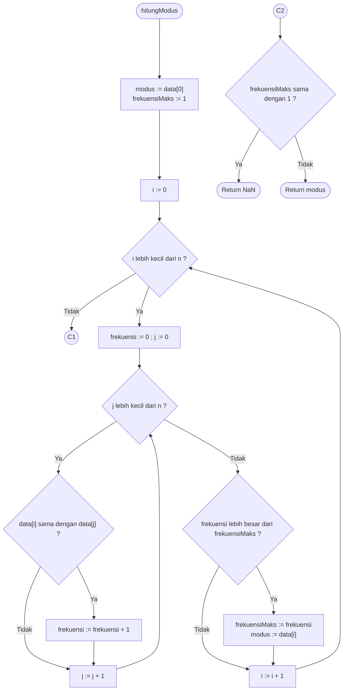

# Dokumentasi Program Analisis Statistika

Dokumentasi ini berisi diagram alir (flowchart) serta penjelasan logis untuk program utama dan fungsi-fungsi pendukungnya.

---

## 1. Flowchart Utama (Program Utama / `main`)

Flowchart ini menggambarkan alur kerja program utama mulai dari input data, pengurutan, kalkulasi statistik, hingga penyajian grafik/kurva.

### Penjelasan Alur (Program Utama)
1. **Inisialisasi & Validasi Input**: Program meminta masukan `n` (jumlah data). Jika $n \le 0$, muncul pesan error dan pengguna diminta memasukkan ulang data.
2. **Penginputan Array**: Menggunakan perulangan (*loop*) `i` dari `0` sampai `n-1` untuk membaca setiap nilai elemen `data[i]`.
3. **Pengurutan Data**: Memanggil fungsi bawaan `sort(data, data + n)` untuk menyusun data secara terurut (*ascending*).
4. **Kalkulasi Nilai Statistika**:
   * Memanggil fungsi pemroses parameter deskriptif: `mean`, `median`, dan `modus`.
   * Menentukan nilai `minimum` (elemen `data[0]`), `maksimum` (elemen `data[n-1]`), serta menghitung `range`.
   * Memanggil pemroses kuartil (`q1` dan `q3`), lalu menghitung `iqr`, `lowerFence`, dan `upperFence`.
   * Menhitung nilai sebaran (`varians`, `standarDeviasi`, dan `skewness`).
5. **Output Hasil & Pemanggilan Modul**:
   * Menampilkan array data terurut.
   * Mengecek ketersediaan modus (`isnan(modus)`). Jika tidak ada, mencetak informasi "Tidak ada modus".
   * Memanggil fungsi modul `analisisOutlier`, `analisisEkor`, dan `tampilkanKurva` untuk visualisasi.

---

## 2. Flowchart 2: Fungsi `analisisOutlier`

Flowchart ini menggambarkan proses deteksi pencilan (outlier) menggunakan dua metode sekaligus: metode jangkauan antar-kuartil (*Fence/IQR*) dan metode *Z-Score*.

### Penjelasan Alur (`analisisOutlier`)
1. **Inisialisasi**: Menetapkan penghitung pencilan `jumlahOutlier = 0` dan indeks perulangan `i = 0`.
2. **Pemeriksaan Per-Elemen**:
   * Untuk tiap `data[i]`, dihitung nilai skor standar `z` melalui `hitungZScore()`.
   * Mengecek dua batas: apakah data melampaui pagar/fence (`< lowerFence` atau `> upperFence`) DAN apakah $\vert{}z\vert{} > 3.0$.
3. **Pengkategorian Outlier**:
   * Jika memenuhi salah satu syarat pencilan, cetak nilai data beserta skor Z-nya.
   * Tentukan label spesifiknya: **Outlier Bawah**, **Outlier Atas**, atau **Outlier berdasarkan Z-Score**.
   * Tambahkan penghitung `jumlahOutlier` sebanyak 1.
4. **Keluaran Akhir**:
   * Setelah seluruh elemen diperiksa (`i >= n`), cek jika `jumlahOutlier == 0`.
   * Jika tidak ada pencilan, tampilkan teks *"Tidak ditemukan outlier"*. Jika ada, cetak total nilai `jumlahOutlier`.

---

## 3. Flowchart 3: Fungsi `hitungModus`

Flowchart ini memperlihatkan algoritma pencarian nilai yang paling sering muncul (modus) di dalam array.

### Penjelasan Alur (`hitungModus`)
1. **Inisialisasi**: Asumsikan kandidat `modus = data[0]` dan frekuensi terbanyak saat ini `frekuensiMaks = 1`.
2. **Nested Loop (Perulangan Bersarang)**:
   * **Loop Luar (`i`)**: Mengiterasi setiap data sebagai acuan pembanding.
   * **Loop Dalam (`j`)**: Menghitung berapa kali nilai `data[i]` muncul di seluruh isi array. Setiap kali ada nilai yang sama (`data[i] == data[j]`), variabel `frekuensi` bertambah 1.
3. **Pembaruan Modus**:
   * Setelah *loop* dalam selesai, bandingkan `frekuensi` data saat ini dengan `frekuensiMaks`.
   * Jika `frekuensi > frekuensiMaks`, perbarui `frekuensiMaks` dengan nilai baru dan tetapkan kandidat `modus = data[i]`.
4. **Pemeriksaan Unik / Hasil Akhir**:
   * Setelah seluruh data selesai dihitung, cek `frekuensiMaks`.
   * Jika `frekuensiMaks == 1` (semua data hanya muncul 1 kali), kembalikan nilai `NaN` (Not a Number).
   * Jika ada frekuensi > 1, kembalikan nilai `modus`.
